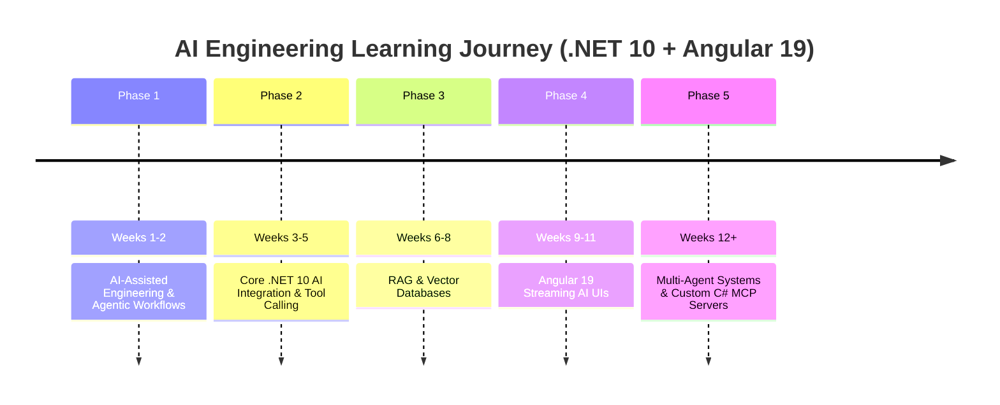

# AI Mastery Roadmap for Senior .NET 10 and Angular 19 Engineers

This is the single consolidated roadmap for learning AI as a senior .NET and Angular engineer. It combines two tracks:

1. **AI-Assisted Engineering**: using AI agents, custom instructions, skills, MCP tools, reviews, tests, and automation to multiply engineering productivity.
2. **AI Engineering**: building production AI capabilities into .NET 10 and Angular 19 applications: LLM integration, structured outputs, tool calling, RAG, streaming UIs, observability, and multi-agent systems.

The goal is not to learn AI as abstract theory first. The goal is to build realistic, enterprise-style capabilities directly inside this workspace.

---

## Roadmap Overview

---

## Learning Strategy

### Track 1: Use AI as a Senior Engineer

Senior engineers should use AI beyond basic code completion. The highest-leverage use cases are architecture support, quality enforcement, automated reviews, test generation, legacy modernization, and agentic execution workflows.

Core practices:

* **Context engineering**: define rules through `AGENTS.md`, `.github/instructions`, `.agents/skills`, and other project-level guidance.
* **Agentic workflows**: move from one-off prompts to `Specification -> Plan -> Execution -> Automated Verification`.
* **Custom skills**: create repeatable playbooks for code reviews, feature specs, migration plans, and architecture audits.
* **MCP tools**: connect agents to real systems such as databases, build tools, logs, telemetry, and internal APIs.
* **Automated quality loops**: use AI to draft tests, inspect diffs, explain failures, and verify fixes through actual commands.

### Track 2: Build AI Features in .NET and Angular

You do not need to switch to Python to become effective at enterprise AI engineering. A strong .NET + Angular stack can cover most real product AI features.

Core practices:

* **Backend AI integration** with `Microsoft.Extensions.AI`, Ollama, OpenAI-compatible providers, Semantic Kernel, and structured outputs.
* **Tool/function calling** so LLMs can safely call C# application services and query live business data.
* **RAG systems** using embeddings, text chunking, vector search, hybrid retrieval, source attribution, and prompt guardrails.
* **Streaming AI UX** in Angular 19 using Signals, SSE or SignalR, markdown rendering, stop controls, and progressive response states.
* **Observability and safety** through OpenTelemetry, usage budgets, prompt injection checks, data sanitization, and audit logs.

---

## Phase 1: AI-Assisted Engineering and Agentic Workflows (Weeks 1-2)

**Goal:** Maximize daily engineering velocity by mastering context engineering, agent governance, custom skills, and tool-based verification.

### What to Learn

* **Project governance**: use `AGENTS.md` and instruction files to enforce architecture standards such as .NET 10 Minimal APIs, primary constructors, Angular 19 Standalone Components, Signals, and modern control flow.
* **Specialized agent skills**: create `SKILL.md` playbooks for repeatable expert tasks such as code review, feature specification, and migration planning.
* **MCP foundations**: understand the difference between a Skill and a Tool.
* **Agent execution workflow**: write clear specs, let the agent execute locally, then verify with builds, tests, API calls, or telemetry.

### Skill vs MCP Tool

| Use Case | Best Fit | Why |
| :--- | :--- | :--- |
| Commit message and PR formatting rules | Skill | This is guidance for AI behavior. |
| Angular 18 to Angular 19 migration checklist | Skill | This is a repeatable reasoning workflow. |
| Run `dotnet build` and return compiler errors | MCP Tool | This executes a real process. |
| Run PostgreSQL `EXPLAIN ANALYZE` and return query plan JSON | MCP Tool | This connects to a real system and returns runtime data. |

### Milestone Project

**Project:** Custom Automated Code Review and Architecture Audit Skill.

**Deliverable:** A reusable skill that audits full-stack pull requests for memory leaks, Signal usage, async EF Core correctness, security boundaries, and project architecture compliance.

### Completed in This Workspace

* Created and refined the `ai-feature-spec` agent skill.
* Added YAML frontmatter so the skill can be discovered by agent tooling.
* Practiced identifying whether a task belongs in a Skill or an MCP Tool.

---

## Phase 2: Core .NET 10 AI Engineering (Weeks 3-5)

**Goal:** Master LLM integration, structured output parsing, and native C# function/tool calling in .NET 10.

### What to Learn

* **`Microsoft.Extensions.AI`**: unified .NET abstraction for chat completions, embeddings, tools, and provider swapping.
* **`IChatClient`**: write application code once, then swap providers such as Ollama, OpenAI, Azure OpenAI, or OpenAI-compatible APIs through DI.
* **Structured JSON outputs**: ask the model for deterministic JSON and deserialize into C# `record` DTOs.
* **Native tool/function calling**: expose C# methods as AI-callable tools so the model can query live application state safely.
* **Local LLMs with Ollama**: use local models for privacy-conscious, low-cost development.

### Milestone Project

**Project:** Smart Natural Language Database Query API.

**Deliverable:** A .NET 10 Minimal API where an LLM is equipped with C# tools to query EF Core data, format structured results, and return natural language insights.

### Completed in This Workspace

* Added `Microsoft.Extensions.AI` to the backend.
* Implemented a development `IChatClient` mock.
* Added AI endpoints for subtask suggestions, structured analysis, and workload assistance.
* Implemented structured output with C# records.
* Implemented native C# tool calling with `AIFunctionFactory`.
* Switched from mock clients to local Ollama wiring with `OllamaSharp`.

### Important Implementation Lesson

`Microsoft.Extensions.AI` keeps endpoint code stable. The endpoint depends on abstractions like `IChatClient` and `IEmbeddingGenerator<string, Embedding<float>>`; provider-specific setup stays in `Program.cs`.

---

## Phase 3: RAG and Vector Databases (Weeks 6-8)

**Goal:** Build enterprise knowledge retrieval systems using embeddings, vector search, hybrid retrieval, and source-grounded generation.

### What to Learn

* **Embeddings**: convert text into vectors that represent semantic meaning.
* **Cosine similarity**: compare vectors to estimate semantic closeness.
* **Text chunking**: split documents into useful chunks for retrieval while preserving source metadata.
* **Vector storage**: compare SQL-native vector search, PostgreSQL `pgvector`, Qdrant, Pinecone, and Azure AI Search.
* **Hybrid search**: combine keyword/BM25-style retrieval with vector retrieval.
* **Re-ranking**: improve result quality after initial retrieval.
* **RAG answer generation**: generate answers only from retrieved context and include exact source attribution.
* **Semantic Kernel and Kernel Memory**: compare low-level custom RAG with higher-level orchestration frameworks.

### Core Math

Cosine similarity compares vectors by angle rather than raw magnitude:

$$
\operatorname{Similarity}(\mathbf{A}, \mathbf{B}) = \frac{\mathbf{A} \cdot \mathbf{B}}{\|\mathbf{A}\| \|\mathbf{B}\|}
$$

Typical interpretation:

* **0.7 to 1.0**: strongly related concepts.
* **0.3 to 0.7**: possibly related, depends on domain.
* **Below 0.3**: likely unrelated.

### Milestone Project

**Project:** Enterprise Document Knowledge Q&A Engine.

**Deliverable:** A .NET 10 application that ingests internal documentation, generates embeddings, stores them in a vector-capable store, performs semantic/hybrid search, and answers questions with exact source attribution.

### Completed in This Workspace

* Added vector similarity math with `VectorMathService`.
* Added a development embedding generator.
* Added a semantic similarity endpoint.
* Wired local Ollama chat and embedding models.
* Added SQL-native vector search, Qdrant comparison endpoints, Semantic Kernel comparison, and Kernel Memory comparison.
* Added caching for embeddings and analytics metrics.
* Added OpenTelemetry/Aspire Dashboard tracing for AI and backend flows.

---

## Phase 4: Angular 19 Streaming AI UI and UX (Weeks 9-11)

**Goal:** Create real-time, responsive, streaming AI interfaces using Angular 19 primitives.

### What to Learn

* **Token streaming**: stream model output from .NET using Server-Sent Events or SignalR.
* **Angular Signals**: bind incoming tokens directly to `signal()`, `computed()`, and modern template control flow.
* **AI UX patterns**: progressive rendering, optimistic UI, markdown and syntax-highlighted code blocks, fallback states, retry states, and stop-generation controls.
* **Dynamic UI from AI**: render charts, forms, or task cards from structured JSON produced by backend AI services.
* **Client-side browser AI**: experiment with Transformers.js or ONNX Runtime Web for local browser tasks when model hosting/network access allows it.

### Milestone Project

**Project:** Full-Stack Streaming AI Assistant and Analytics Dashboard.

**Deliverable:** An Angular 19 single-page app using Standalone Components and Signals, connected to a .NET 10 backend that streams AI responses over SSE or SignalR and renders dynamic analytics views.

---

## Phase 5: Multi-Agent Systems and Custom C# MCP Servers (Weeks 12+)

**Goal:** Build multi-agent autonomous systems and expose enterprise backend capabilities to AI agents through MCP.

### What to Learn

* **Multi-agent orchestration**: create specialized agents such as Planner, Developer, Reviewer, and Operator agents.
* **Semantic Kernel Agents or AutoGen .NET**: evaluate orchestration frameworks for C# agent workflows.
* **Custom C# MCP servers**: expose internal APIs, databases, logs, telemetry, and business workflows to AI assistants.
* **Observability**: trace LLM calls, tool calls, latency, token cost, and failures with OpenTelemetry.
* **Guardrails**: add prompt injection prevention, data sanitization, authorization checks, and read/write safety boundaries.

### Milestone Project

**Project:** Enterprise C# MCP Server and Multi-Agent Workflow.

**Deliverable:** A custom C# MCP server that allows AI assistants to safely query enterprise data and trigger approved business operations through standardized tools.

### Completed in This Workspace

* Added a separate C# MCP server project.
* Exposed read-only work item tools.
* Added telemetry tools that query the local Aspire Dashboard.
* Verified MCP behavior through the official MCP inspector CLI.

---

## Full-Stack Tech Stack Reference

| Layer | Recommended Technologies |
| :--- | :--- |
| Backend Framework | .NET 10 Minimal APIs, C# 13/14 style records and primary constructors |
| Unified AI Abstraction | `Microsoft.Extensions.AI` |
| Chat Providers | Ollama, OpenAI, Azure OpenAI, OpenAI-compatible APIs |
| Local Model Runtime | Ollama + `OllamaSharp` |
| Enterprise AI Framework | Semantic Kernel |
| RAG Framework Comparison | Custom RAG, Qdrant, Kernel Memory |
| Vector Search | SQL Server native vector, PostgreSQL `pgvector`, Qdrant, Azure AI Search |
| Frontend Framework | Angular 19 Standalone Components + Signals |
| Streaming Transport | Server-Sent Events or ASP.NET Core SignalR |
| Agent Protocol | Model Context Protocol |
| Observability | OpenTelemetry + Aspire Dashboard |
| Safety | Prompt guards, data sanitization, rate limits, token budgets, audit logs |

---

## Current Hands-On Progress

| Area | Status | Evidence |
| :--- | :--- | :--- |
| Agent governance | Complete | `AGENTS.md`, custom skills, instruction files |
| AI feature spec skill | Complete | `.agents/skills/ai-feature-spec/SKILL.md` |
| `Microsoft.Extensions.AI` chat integration | Complete | AI endpoints using `IChatClient` |
| Structured outputs | Complete | Structured analysis endpoint returning typed JSON |
| C# function calling | Complete | Workload assistant endpoint using AI tools |
| Local real LLM setup | In progress/active | Ollama wired in `Program.cs`; local models used for chat and embeddings |
| Vector similarity | Complete | Semantic similarity endpoint and vector math service |
| RAG pipeline | In progress/active | SQL vector, Qdrant, Semantic Kernel, and Kernel Memory comparisons |
| Streaming Angular AI UI | Next major frontend milestone | Phase 4 target |
| MCP server | Started | C# MCP server with read-only tools and telemetry tools |

---

## Quick Start Checklist

- [x] Set up workspace context rules with `AGENTS.md`.
- [x] Create custom agent skills for code review and feature specification.
- [x] Install `Microsoft.Extensions.AI` in the .NET backend.
- [x] Test basic chat completion through `IChatClient`.
- [x] Implement structured output parsing into C# records.
- [x] Implement tool calling in C# so an LLM can use application methods.
- [x] Add local Ollama provider wiring.
- [x] Build vector similarity and embedding endpoints.
- [x] Compare custom RAG, Qdrant, Semantic Kernel, and Kernel Memory approaches.
- [ ] Build the Angular 19 streaming AI assistant UI.
- [ ] Add production-grade RAG evaluation and regression tests.
- [ ] Harden MCP tools with authorization, write-operation guardrails, and telemetry.

---

## Recommended Next Steps

1. **Finish Phase 3 cleanly**: stabilize the RAG pipeline, document tradeoffs between SQL vector search, Qdrant, Semantic Kernel, and Kernel Memory, and add tests around retrieval quality.
2. **Start Phase 4**: build an Angular 19 streaming AI UI using Signals and SSE or SignalR.
3. **Production hardening**: add prompt injection checks, token budget limits, audit logs, OpenTelemetry dashboards, and regression tests for AI responses.
4. **Return to Phase 5**: expand the MCP server from read-only tools to carefully guarded write workflows.

---

## Key Resources

* [.NET AI documentation](https://learn.microsoft.com/en-us/dotnet/ai/)
* [Microsoft.Extensions.AI documentation](https://learn.microsoft.com/en-us/dotnet/ai/microsoft-extensions-ai)
* [Semantic Kernel for .NET](https://github.com/microsoft/semantic-kernel)
* [Ollama](https://ollama.com/)
* [OllamaSharp](https://github.com/awaescher/OllamaSharp)
* [Model Context Protocol](https://modelcontextprotocol.io/)
* [Qdrant documentation](https://qdrant.tech/documentation/)
* [OpenTelemetry for .NET](https://opentelemetry.io/docs/languages/dotnet/)

---

## Guiding Principle

Use AI like a senior engineer: define the architecture, constrain the system, let tools do measurable work, and verify everything with builds, tests, traces, and real API calls.
